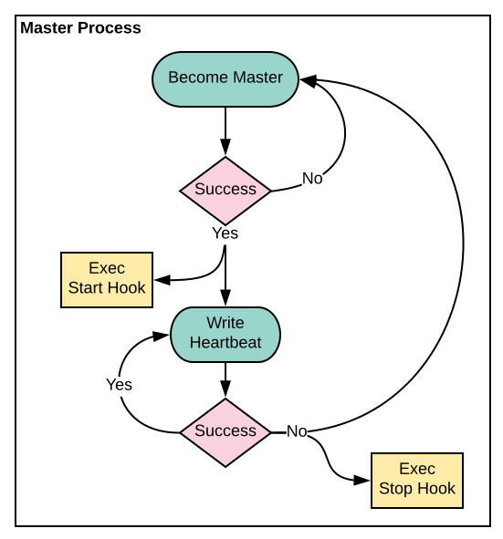

[](https://travis-ci.com/InVisionApp/go-background)


# go-master
A simple framework for master selection using flexible backends. With the proliferation of micro-services, there are often cases where a clustered service that already has a shared backend resource will need to implement master selection. This library provides a simple way to enable master selection in a clustered service with a shared backend. It also includes a set of swappable lock implementations for common backends.  
Unlike more complex leader election mechanisms based on consensus algorithms, this simply uses a lock on a shared resource. In an environment of micro-services running in a docker orchestration platform it can often be difficult to obtain direct communication channels between all the nodes of a service, and many services will already require a backend database to store shared state. This master selection library is designed to cover those use cases.

## Example Use Cases
**Database migrations** - In-app database migrations can be difficult to run in a clustered application. Use go-master to pick a master node and only run migrations from the master.

**Background tasks** - Periodic background tasks such as sending email that should only run once per period can run on the master.

## Master Selection

There is a single master at all times. The master is chosen using the master lock backend. All nodes will attempt to become a master, but only one will succeed. The node chosen to be the master will write a heartbeat to the master lock while it is healthy and executing its duties. 

<br><br><br><br><br><br><br><br><br><br>

## Start and Stop Hooks
Custom start and stop hooks can be used to define what happens when a node becomes a master or is no longer a master. When a node becomes a master, the provided start hook function will be executed as a way of notifying your code that the current node is now the master. Similarly, when a node is no longer a master, the stop hook is called. The master selection mechanism does not block on these hook functions nor does it receive an error. If a critical error occurs in your start hook such that this node should not continue as the master, use the `Stop()` method to stop the node from continuing as a master.

## Supported Backends
This library comes with support for a set of backend databases that are commonly used. All backend implementations can be found in `go-master/backend`, each under their own packages.

Currently supported: 
- MongoDB
- MySQL

### Example backend usage
```go
	"github.com/InVisionApp/go-master"
	"github.com/InVisionApp/go-master/backend/mysql"

	mysqlBackend := mysql.NewMySQLBackend(&mysql.MySQLBackendConfig{
		User:     "user",
		Password: "pass",
		Host:     "localhost",
		Port:     3306,
		DBName:   "gomaster",
	})

	if err := mysqlBackend.Connect(); err != nil {
		logger.Errorf("Unable to connect to MySQL: %v", err)
		return err
	}
	
	m := master.New(&master.MasterConfig{
		MasterLock: mysqlBackend,
		Logger:     logger,
	})

	if err := m.Start(); err != nil {
		logger.Errorf("Unable to start go-master: %v", err)
		return err
	}

```

---

#### \[Credit\]
The go-master gopher image by [talpert](https://github.com/talpert)  
Original artwork designed by Renée French
